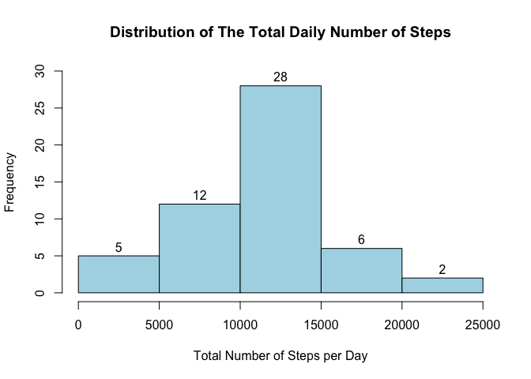
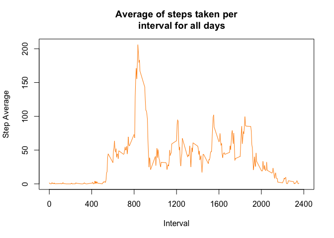
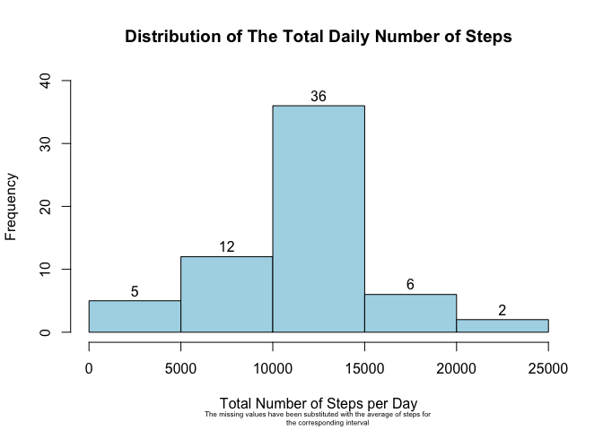
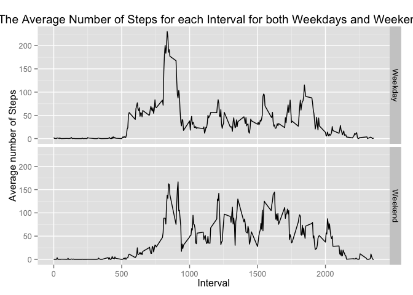

# Reproducible Research: Peer Assessment 1


## Loading and preprocessing the data
The data is read directly from the file activity.csv and stored in a variable called my_data.


```r
    ## This assumes that the file activity.csv is in the same work directory as the
    ## current work directory
    my_data<-read.csv("activity.csv",sep=",",header=TRUE)
    my_data$date<-as.POSIXct(my_data$date)
```


## What is mean total number of steps taken per day?
The total number of steps is calculated for each day below using the summarize function from the dplyr package.


```r
    library(dplyr)
```

```
## 
## Attaching package: 'dplyr'
## 
## The following object is masked from 'package:stats':
## 
##     filter
## 
## The following objects are masked from 'package:base':
## 
##     intersect, setdiff, setequal, union
```

```r
    compl<-complete.cases(my_data)
    daily_sum<-summarize(group_by(my_data[compl,],date),SumSteps=sum(steps))
```

The total number of steps is plotted below in a histogram:

```r
    hist(daily_sum$SumSteps, freq=TRUE, xlab="Total Number of Steps per Day", 
         main="Distribution of The Total Daily Number of Steps", 
         col="lightblue",breaks=7,ylim=c(0,30),labels=TRUE)
```

 

The mean of the of the total number of steps is:

```r
    mean(daily_sum$SumSteps)
```

```
## [1] 10766.19
```

and the median of the total number of steps is:

```r
    median(daily_sum$SumSteps)
```

```
## [1] 10765
```


## What is the average daily activity pattern?
The plot below shows the average daily activity of all days for the specified intervals:  


```r
    avg_steps<-summarize(group_by(my_data[compl,],interval),AvgSteps=mean(steps))
    with(avg_steps,plot(x=interval,y=AvgSteps,type="l",main="Average of steps taken per
    interval for all days",xlab= "Interval",ylab="Step Average",col="darkorange",
    xlim=c(0,2400),xaxt="n"))
    axis(side=1,at=c(0,400,800,1200,1600,2000,2400))
```

 

The 5-minute interval with the highest step average is:


```r
    n<-which(avg_steps$AvgSteps==max(avg_steps$AvgSteps))
    as.integer(avg_steps[n,1])
```

```
## [1] 835
```


## Imputing missing values
The number of rows that contain missing values and which are denoted in this dataset by NA is:


```r
    length(my_data$interval)-length(my_data[compl,]$interval)
```

```
## [1] 2304
```

The missing values are substituted with the average of the interval they fall in rounded to integer values and the new dataset is stored in the variable subNA_data.


```r
    subNA_data<-my_data
    
    for (i in 1:length(my_data$interval)){
        
        if (is.na(my_data[i,]$steps)){
            n<-which(avg_steps$interval==my_data[i,]$interval)
            subNA_data[i,]$steps<-round(avg_steps[n,]$AvgSteps)
            }
        
        else{}
        
        }
```

The new dataset with the replaced missing values is used to recalculate the sum of steps per day. And the corresponding values are plotted in the histogram below:


```r
    ndaily_sum<-summarize(group_by(subNA_data,date),SumSteps=sum(steps)) 
    par(cex.sub=0.5,adj=0.5)
    hist(ndaily_sum$SumSteps, freq=TRUE, xlab="Total Number of Steps per Day", 
         main="Distribution of The Total Daily Number of Steps",
         sub="The missing values have been substituted with the average of steps for 
         the corresponding interval",col="lightblue",breaks=7,ylim=c(0,40),
         labels=TRUE)
```

 

The corresponding mean of the daily total number of steps is given by:

```r
    mean(ndaily_sum$SumSteps)
```

```
## [1] 10765.64
```

and the corresponding median is as follows:

```r
    median(ndaily_sum$SumSteps)
```

```
## [1] 10762
```

These new values obtained for the mean and median differ from the values we obtained earlier where the missing values were ignored instead of substituted with the rounded average of the steps in the specific interval. 
Inputing missing data increased the estimates of the total daily number of steps and that is expected.

## Are there differences in activity patterns between weekdays and weekends?
A column is added to the dataset that has been created earlier with the missing values substituted for with averages for the respective intervals. The new column identifies if the day is a "weekday" or a "weekend". 

```r
subNA_data<-mutate(subNA_data,Day=weekdays(date))
subNA_data[!is.na(match(subNA_data$Day,c("Monday","Tuesday","Wednesday","Thursday", "Friday"))),]$Day<-"Weekday"
subNA_data[!is.na(match(subNA_data$Day,c("Sunday","Saturday"))),]$Day<-"Weekend"
subNA_data$Day<-factor(subNA_data$Day)
```
The following plot shows the distribution of the average number of steps for each interval for both weekdays and weekends:

```r
    library(ggplot2)
    avg_steps2<-summarize(group_by(subNA_data,interval,Day),AvgSteps=mean(steps))
    p<-ggplot(avg_steps2,aes(interval,AvgSteps))+geom_line()+
    facet_grid(Day~.)+ylab("Average number of Steps")+ggtitle("The Average Number of Steps for each Interval for both Weekdays and Weekends")+xlab("Interval")
    print(p)
```

 

The plot above shows that the patterns in average number of steps per interval are a bit different however the interval with the highest average is still the same for both.
